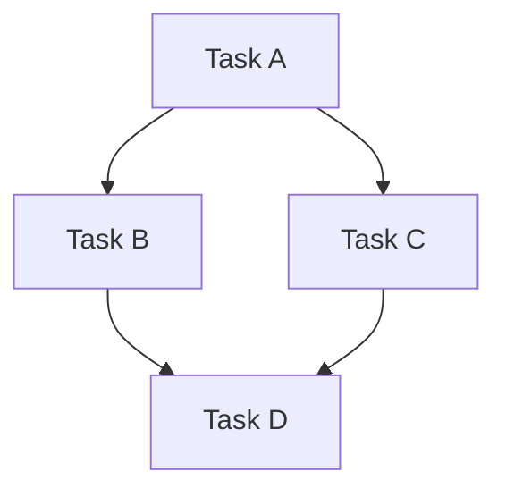

# Analyze Todo Structure

Analyzes your current TodoWrite tasks to identify:
- Dependency relationships and task hierarchy
- Potential conflicts (incomplete subtasks, orphaned tasks, etc.)
- Critical path and task ordering
- Overall completion percentage
- Recommendations for optimization

## Usage

```bash
/metamanager:analyze              # Analyze all tasks (default format)
/metamanager:analyze --json       # Output as JSON for processing
/metamanager:analyze --mermaid    # Output as Mermaid diagram syntax
```

## Output Format (Default)

Shows a comprehensive analysis including:

1. **Task Summary**
   - Total tasks: N
   - Completed: N (%)
   - In Progress: N
   - Pending: N
   - Blocked: N

2. **Dependency Analysis**
   - Critical path tasks (highest impact)
   - Bottleneck tasks (block multiple others)
   - Parallelizable groups
   - Depth of dependency hierarchy

3. **Conflict Detection**
   - Any incomplete subtasks
   - Orphaned or disconnected tasks
   - Abandoned tasks (not updated 7+ days)
   - Circular dependencies (if any)

4. **Graph Visualization**
   ```
   Phase 1
   ├─ Task A
   └─ Task B

   Phase 2
   ├─ Task C (blocked by A)
   └─ Task D (blocked by B)
   ```

5. **Recommendations**
   - Tasks ready to start
   - Optimization opportunities
   - Risk areas
   - Suggested next steps

## JSON Output

```json
{
  "analysis": {
    "summary": {
      "total_tasks": 10,
      "completed": 3,
      "in_progress": 2,
      "pending": 4,
      "blocked": 1
    },
    "completion_percentage": 30,
    "critical_path": ["task-1", "task-3", "task-5"],
    "bottlenecks": ["task-3"],
    "conflicts": [],
    "phases": [...],
    "parallelizable_groups": [...]
  }
}
```

## Mermaid Output

Generates Mermaid graph syntax ready for rendering:



Paste output into Mermaid diagram renderer for visualization.

## Examples

### Analyze All Tasks
```
/metamanager:analyze
```

Output shows complete task structure with conflicts and recommendations.

### Export as JSON
```
/metamanager:analyze --json
```

Useful for integration with other tools or further processing.

### Create Visualization
```
/metamanager:analyze --mermaid
```

Copy output to Mermaid editor for visual task graph.

## What Gets Analyzed

1. **Dependencies**
   - Direct blockers (immediate prerequisites)
   - Transitive blockers (all prerequisites)
   - Dependent tasks (what depends on each)

2. **Structure**
   - Task hierarchy (parents/children)
   - Subtask completion
   - Phase organization

3. **Status**
   - Completion percentages
   - Blocking relationships
   - Task age (for abandonment detection)

4. **Conflicts**
   - Incomplete subtasks
   - Orphaned tasks
   - Circular dependencies
   - Abandonment risk

5. **Optimization**
   - Parallelization opportunities
   - Critical path identification
   - Bottleneck analysis
   - Reordering suggestions

## Tips

- Run before major changes to understand impact
- Use JSON output for programmatic analysis
- Check recommendations for optimization ideas
- Review conflicts regularly to prevent blockers
- Reference task IDs from output when creating plans
