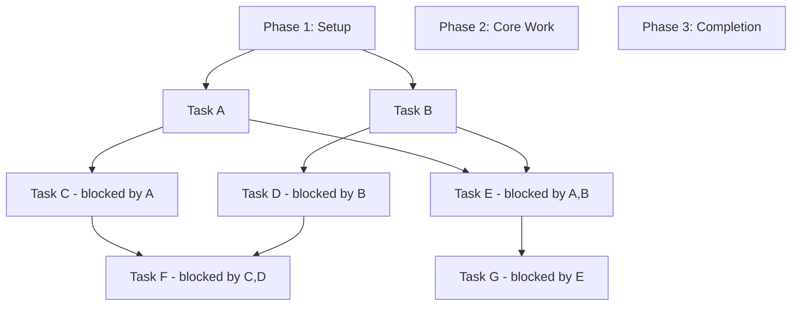

# Visualize Task Graph

Creates visual representation of your task structure showing:
- Dependencies and blocking relationships
- Task hierarchy and organization
- Phase structure
- Critical path

## Usage

```bash
/metamanager:visualize              # ASCII visualization (default)
/metamanager:visualize --format=mermaid  # Mermaid diagram syntax
/metamanager:visualize --format=json     # JSON graph representation
```

## Output Formats

### Text (Default)

ASCII tree showing hierarchy and dependencies:

```
Project Root
├─ Phase 1: Setup
│  ├─ [Task A]
│  └─ [Task B]
│
├─ Phase 2: Core Work
│  ├─ [Task C] (blocked by A)
│  ├─ [Task D] (blocked by B)
│  └─ [Task E] (blocked by A, B)
│
└─ Phase 3: Completion
   ├─ [Task F] (blocked by C, D)
   └─ [Task G] (blocked by E)

Legend:
  [Task] = Pending/In Progress
  ✓Task = Completed
  ⚠Task = Blocked
  ◆Task = On critical path
```

### Mermaid

Graph syntax for rendering in Mermaid editor:



Paste the output into [Mermaid Live Editor](https://mermaid.live) to render.

### JSON

Raw graph data structure:

```json
{
  "graph": {
    "graph_id": "current",
    "tasks": {
      "task-1": {
        "name": "Task A",
        "status": "pending",
        "dependencies": [],
        "dependents": ["task-3", "task-5"],
        "phase": 1
      },
      "task-2": {
        "name": "Task B",
        "status": "pending",
        "dependencies": [],
        "dependents": ["task-4", "task-5"],
        "phase": 1
      },
      ...
    },
    "phases": [
      {"phase": 1, "tasks": ["task-1", "task-2"]},
      {"phase": 2, "tasks": ["task-3", "task-4", "task-5"]},
      ...
    ]
  }
}
```

## Options

### --format
Choose output format:
- `text` (default): ASCII tree
- `mermaid`: Graph syntax
- `json`: Raw data

### --all
Include all tasks (default is all).

## Symbol Legend

In text format:

| Symbol | Meaning |
|--------|---------|
| `[Task]` | Pending or in-progress |
| `✓Task` | Completed |
| `⚠Task` | Blocked (waiting for dependencies) |
| `◆Task` | On critical path |
| `→` | Dependency arrow |
| `├─` | Tree branch |
| `└─` | Tree end |

## Examples

### ASCII Tree View
```
/metamanager:visualize
```

Shows hierarchy with dependencies clearly marked.

### Mermaid Diagram
```
/metamanager:visualize --format=mermaid
```

Creates renderable graph diagram. Copy-paste into:
- Mermaid Live Editor
- GitHub issues/PRs
- Markdown documents
- Confluence/wikis

### JSON Export
```
/metamanager:visualize --format=json
```

For programmatic processing, tool integration, or custom analysis.

## Reading the Graph

### Dependencies
If you see: `Task C (blocked by A)`, it means:
- Task A must complete before Task C can start
- Task A is a **blocker** or **prerequisite**
- Task C **depends on** Task A

### Critical Path
Tasks marked with `◆` are on the longest dependency chain:
- Any delay here affects total project time
- Prioritize these first

### Phases
Tasks grouped by phase number execute sequentially:
- All Phase 1 tasks complete before Phase 2
- Within a phase, tasks can run in parallel

## Use Cases

### Project Overview
```
/metamanager:visualize
```
Get quick understanding of task structure and dependencies.

### Share with Team
```
/metamanager:visualize --format=mermaid
```
Create shareable diagram for planning discussions.

### Analyze Programmatically
```
/metamanager:visualize --format=json
```
Extract data for custom analysis or reports.

## Tips

- Use text format for quick reference
- Use Mermaid for presentations/sharing
- Use JSON for detailed analysis
- Check for complex dependency chains
- Look for bottlenecks (many dependents)
- Review for orphaned or disconnected tasks
