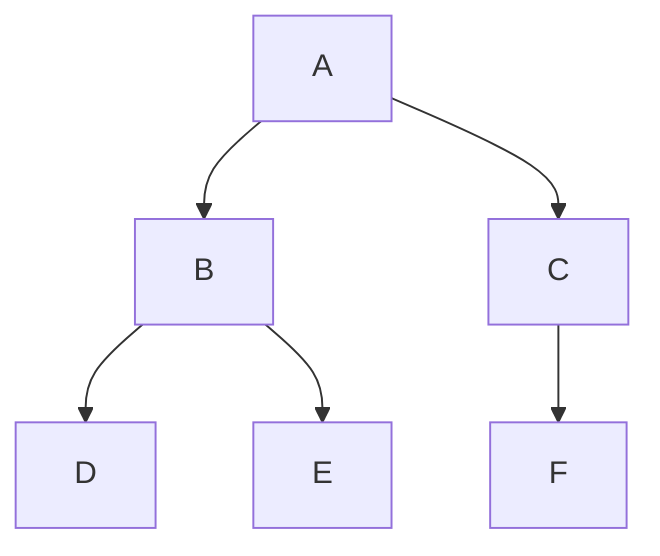

# Task Dependency Analysis Skill

Systematically analyze task relationships to understand execution constraints and identify critical paths.

## When This Skill Activates

Use when user asks about:
- "What blocks this task?"
- "What must happen before task X?"
- "What depends on task Y?"
- "Is there a circular dependency?"
- "What's the critical path?"
- "Which tasks can run in parallel?"
- "What's blocking progress?"

## Analysis Process

### 1. Load Task Graph
- Retrieve current task graph from Supermemory
- Verify graph integrity
- Check for cycles or corruption
- Validate all task references

### 2. Identify Direct Dependencies
For each task, identify:
- Immediate blockers (direct dependencies)
- Immediate dependents (tasks waiting on this one)
- Subtasks (child tasks)
- Parent tasks

### 3. Identify Transitive Dependencies
- Direct blockers: tasks that must complete first
- Indirect blockers: tasks that block the blockers
- Full chain: from root to leaf
- Complete closure: all dependencies transitively

### 4. Create Visual Representation

**ASCII Tree Format**:
```
Task A (blocking)
├─> Task B
│   ├─> Task D
│   └─> Task E
└─> Task C
    └─> Task F
```

**Mermaid Graph Format**:


### 5. Calculate Impact Analysis
For each task:
- How many tasks directly depend on it?
- How many tasks transitively depend on it?
- If removed, what would break?
- Criticality to overall execution

### 6. Identify Optimization Opportunities
- Can dependencies be parallelized?
- Are there unnecessary dependencies?
- Can tasks be reordered?
- Can tasks be split for better parallelization?

## Key Questions to Answer

1. **What's blocking this task?**
   - List all dependencies
   - Explain which are critical
   - Show alternatives

2. **What depends on this task?**
   - Count downstream tasks
   - Show critical dependents
   - Estimate impact of delays

3. **What's the critical path?**
   - Identify longest dependency chain
   - Show duration impact
   - Suggest acceleration points

4. **Can these run in parallel?**
   - Check for inter-dependencies
   - Confirm non-conflicting
   - Estimate time savings

5. **How deep is the dependency chain?**
   - Count steps from root to leaf
   - Identify depth bottlenecks
   - Suggest restructuring

## Output Format

Document your analysis with:

1. **Dependency Summary**
   ```
   Task: Feature Implementation
   ├─ Blockers: 2 (database setup, API design)
   ├─ Dependents: 3 (testing, documentation, deployment)
   └─ Depth: 4 levels
   ```

2. **Critical Path**
   ```
   Design → Database Setup → Data Model → Implementation
   Duration: ~3 weeks
   ```

3. **Parallel Opportunities**
   ```
   Can parallelize:
   - UI Development (parallel with API development)
   - Test Writing (parallel with implementation)
   - Documentation (parallel with testing)
   ```

4. **Recommendations**
   - "Split task X to improve parallelization"
   - "Move task Y earlier to unblock X sooner"
   - "Combine tasks A and B to reduce coordination"

## Common Patterns

### Linear Chain
```
A → B → C → D
```
**Issue**: Sequential, no parallelization
**Solution**: Look for ways to split or parallelize subtasks

### Diamond Pattern
```
    A
   / \
  B   C
   \ /
    D
```
**Good for**: Parallel work that reconverges
**Risk**: Both B and C must complete before D starts

### Fan Pattern
```
A → B → C → D → E → F
```
**Issue**: High depth, long critical path
**Solution**: Parallelize where possible, split tasks

## Avoiding Common Mistakes

1. **Assuming independence**
   - Always verify no transitive dependencies
   - Check both directions (blocks and blocked-by)

2. **Missing subtask dependencies**
   - Include child tasks in analysis
   - Verify parent-child relationships

3. **Ignoring subtle blocking relationships**
   - Check resource contention
   - Consider execution order dependencies

4. **Over-optimizing**
   - Some dependencies are necessary
   - Trade-off between parallelization and complexity

## Tools and Queries

Use these for dependency analysis:
- Load task graph: Get current state from Supermemory
- Topological sort: Find valid execution order
- Find cycles: Detect circular dependencies
- Calculate depth: Measure task distance from root
- Identify parallel groups: Find independent work

---

**This skill is automatically invoked when analyzing task relationships, dependencies, and execution constraints.**
